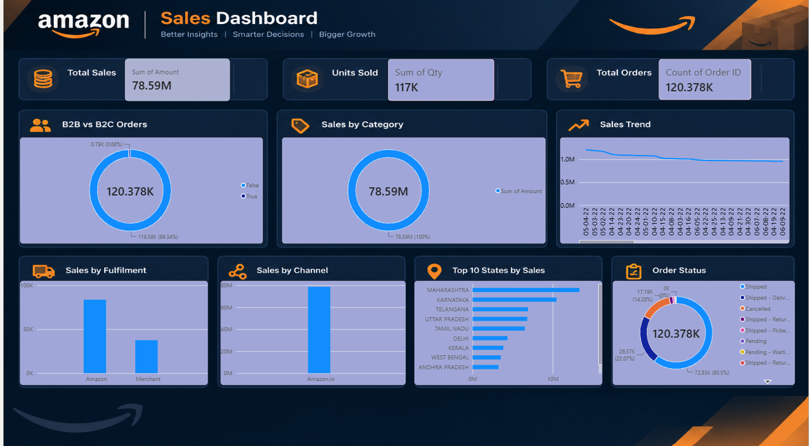

# Amazon Sales Analysis Dashboard

An interactive Amazon Sales Analysis Dashboard built using Power BI to monitor sales performance, analyze orders and quantities, and explore sales trends through dynamic reporting and visualizations.

## Features

- Interactive Sales Analysis Dashboard
- KPI Cards
- Interactive Charts and Visualizations
- Sales Trend Analysis
- State-wise Sales Analysis
- Order Status Analysis
- Fulfilment Analysis
- Sales Channel Analysis
- B2B vs B2C Analysis
- Dynamic Data Filtering
- Power Query Transformations
- DAX Measures
- Data Cleaning and Transformation

## KPIs

- Total Sales Amount
- Total Units Sold
- Total Orders

## Tech Stack

- Power BI
- Power Query
- DAX
- Data Modeling
- Data Cleaning
- Data Transformation
- Data Visualization

## Dashboard Preview



## Data Preparation

The Amazon sales dataset was prepared and processed using Power Query.

The data preparation process included:

- Data cleaning
- Handling missing or inconsistent values
- Correcting data types
- Data transformation
- Preparing fields for analysis
- Creating the required data model

## Key Analysis

The dashboard provides insights into:

- Overall Amazon sales performance
- Sales trends over time
- Sales by category
- State-wise sales performance
- Order status distribution
- Fulfilment performance
- Sales channel performance
- B2B vs B2C order patterns

## Dashboard Overview

The dashboard provides a summarized view of Amazon sales data through KPI cards, charts, and interactive visualizations.

The main dashboard includes:

- Total Sales
- Units Sold
- Total Orders
- B2B vs B2C Orders
- Sales by Category
- Sales Trend
- Sales by Fulfilment
- Sales by Channel
- Top States by Sales
- Order Status

## Project Objective

The main objective of this project is to transform Amazon sales data into an interactive Power BI dashboard that makes it easier to understand sales performance, order patterns, geographical distribution, fulfilment, and sales channels.

## How to Use

1. Download the `AMAZON DASHBOARD.pbix` file.
2. Open it using Microsoft Power BI Desktop.
3. Interact with the available charts and visualizations.
4. Use available filters or interactive elements to explore the data.
5. Review the KPI cards and charts to understand Amazon sales performance.

## Project Structure

```text
Amazon-Sales-Analysis-Dashboard
│
├── AMAZON DASHBOARD.pbix
├── dashboard.png
└── README.mdConclusion

The Amazon Sales Analysis Dashboard converts raw sales data into an interactive visual report. It combines KPI cards, charts, data transformation, and visualization techniques to make Amazon sales analysis easier and more understandable.

Future Enhancements

Future versions of the dashboard can include:

Drill-through analysis
Dedicated detail pages
Page navigation
Advanced filtering
Product-level analysis
Sales forecasting
Additional DAX measures
Customer segmentation
Feedback & Suggestions

Suggestions and feedback are welcome for improving the dashboard. Future improvements can focus on adding more detailed analysis, advanced interactive features, forecasting, and additional business insights.
